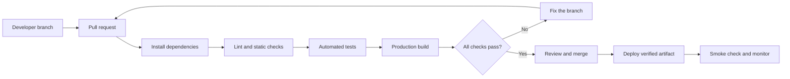

# CI/CD Guide

## The short explanation

**Continuous integration (CI)** automatically checks every proposed change.
Instead of trusting that code works on one laptop, a clean machine installs the
project and runs the agreed checks.

**Continuous delivery/deployment (CD)** prepares or releases code after CI passes.
Delivery means the application is ready for a controlled release. Deployment
means an approved change is released automatically.

CI answers: “Is this change safe enough to merge?”

CD answers: “Can this verified version be released predictably?”

## Planned flow

The branch contains one focused change. The pull request triggers CI. Each arrow
represents a gate: later work proceeds only if the previous check succeeds. After
review and merge, CD deploys the exact version that passed validation. A smoke
check confirms that the deployed application starts and serves its critical path.

This diagram intentionally omits deployment-provider details. The application
stack is selected, but the deployment host is not. Pretending to have a final CD
pipeline now would create fragile documentation.

## Implemented CI workflow

The workflow at `.github/workflows/ci.yml`:

1. Run for pull requests and pushes to the primary branch.
2. Check out the repository.
3. Read the supported Node.js version from `.nvmrc`.
4. Cache npm's download data using the lockfile as the cache key.
5. Install exact dependencies with `npm ci`.
6. Check formatting, static analysis, and TypeScript types.
7. Run unit and DOM integration tests.
8. Create a production build.

Each quality gate is a separate step, making a failure easy to locate in GitHub's
workflow log. The steps share one job so dependencies are installed only once.

The workflow uses read-only repository permissions, does not retain checkout
credentials, and pins external actions to exact release commits. Concurrent runs
for the same branch are cancelled when a newer commit makes them obsolete.

`npm ci` differs from `npm install`: it refuses to modify the lockfile and creates
a clean dependency installation from that lockfile. This makes CI more
reproducible than resolving potentially different dependency versions on every
run.

The npm cache stores downloaded package data, not the `node_modules` directory.
The lockfile remains the source of truth, and `npm ci` still performs the clean
installation.

## Protected primary branch

The `master` branch is protected on GitHub. The live policy requires:

- every change to arrive through a pull request;
- the `Quality gates` check to pass against the latest `master` commit;
- all pull-request conversations to be resolved;
- a linear Git history;
- administrators to follow the same rules;
- force pushes and branch deletion to remain disabled.

The required approval count is intentionally zero while the project has one
maintainer. GitHub does not allow a pull-request author to approve their own
change, so requiring one approval would block legitimate solo development. Once
another maintainer regularly reviews changes, raise the requirement to at least
one approval.

These rules turn CI from information into enforcement. A failed or pending check
prevents merging, even if the change appears to work locally. Repository
administrators can modify the policy, but changes should be documented and made
only for an explicit operational reason.

## Why CI is valuable

CI catches problems such as:

- a test that passes locally but fails in a clean environment;
- forgotten formatting or lint errors;
- missing or inconsistent dependencies;
- code that cannot produce a production build;
- a branch that no longer integrates with recent changes.

CI does not prove that the application is bug-free. Tests only protect behaviors
we actually specify, and automated checks do not replace code review, usability
testing, accessibility testing, or operational monitoring.

## Safe path to CD

Do not start with automatic production deployment before the application has a
real deployable slice. Add CD progressively:

1. **Build validation:** prove a deployable artifact can be created.
2. **Preview deployment:** create an isolated URL for a pull request.
3. **Staging deployment:** validate the merged application in a production-like
   environment.
4. **Production delivery:** require explicit approval initially.
5. **Automated production deployment:** consider only after rollback, monitoring,
   and team confidence are established.

## Secrets and permissions

- Store deployment credentials in GitHub environment or repository secrets.
- Never place credentials in source files, workflow logs, or example values.
- Give workflow jobs only the permissions they require.
- Protect the production environment with approval rules when available.
- Prefer short-lived identity federation over permanent deployment tokens when
  the selected host supports it.
- Treat contributions from forks as untrusted code.

## Rollback and observability

A professional deployment process includes a recovery plan. Before automated
production deployment, document:

- how to identify the deployed commit;
- how to restore the previous known-good version;
- who or what decides a rollback is necessary;
- where build, deployment, and runtime errors are visible;
- which smoke checks establish basic health.

## Pipeline changes are code changes

CI/CD files can publish software and access credentials, so they require review
and testing. Pipeline changes should usually be isolated in a `ci` commit. This
first workflow deliberately performs no deployment and receives no deployment
credentials.
