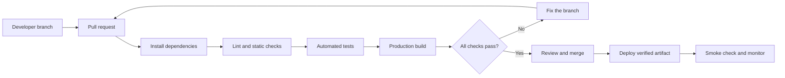

# CI/CD Guide

## The short explanation

**Continuous integration (CI)** automatically checks every proposed change.
Instead of trusting that code works on one laptop, a clean machine installs the
project and runs the agreed checks.

**Continuous delivery/deployment (CD)** prepares or releases code after CI passes.
Delivery means the application is ready for a controlled release. Deployment
means an approved change is released automatically.

CI answers: “Is this change safe enough to merge?”

CD answers: “Can this verified version be released predictably?”

## Planned flow

The branch contains one focused change. The pull request triggers CI. Each arrow
represents a gate: later work proceeds only if the previous check succeeds. After
review and merge, CD deploys the exact version that passed validation. A smoke
check confirms that the deployed application starts and serves its critical path.

This diagram intentionally omits deployment-provider details. The application
stack is selected, but the deployment host is not. Pretending to have a final CD
pipeline now would create fragile documentation.

## What the first CI workflow should check

After the project is scaffolded, the initial GitHub Actions workflow should:

1. Run for pull requests and pushes to the primary branch.
2. Check out the repository.
3. Install the supported runtime version.
4. Install dependencies from the lockfile using a reproducible command.
5. Run formatting and lint checks.
6. Run unit and integration tests.
7. Create a production build.

The workflow should use least-privilege permissions, pin important environment
versions, and cache dependencies only when it remains correct to do so.

## Why CI is valuable

CI catches problems such as:

- a test that passes locally but fails in a clean environment;
- forgotten formatting or lint errors;
- missing or inconsistent dependencies;
- code that cannot produce a production build;
- a branch that no longer integrates with recent changes.

CI does not prove that the application is bug-free. Tests only protect behaviors
we actually specify, and automated checks do not replace code review, usability
testing, accessibility testing, or operational monitoring.

## Safe path to CD

Do not start with automatic production deployment before the application has a
real deployable slice. Add CD progressively:

1. **Build validation:** prove a deployable artifact can be created.
2. **Preview deployment:** create an isolated URL for a pull request.
3. **Staging deployment:** validate the merged application in a production-like
   environment.
4. **Production delivery:** require explicit approval initially.
5. **Automated production deployment:** consider only after rollback, monitoring,
   and team confidence are established.

## Secrets and permissions

- Store deployment credentials in GitHub environment or repository secrets.
- Never place credentials in source files, workflow logs, or example values.
- Give workflow jobs only the permissions they require.
- Protect the production environment with approval rules when available.
- Prefer short-lived identity federation over permanent deployment tokens when
  the selected host supports it.
- Treat contributions from forks as untrusted code.

## Rollback and observability

A professional deployment process includes a recovery plan. Before automated
production deployment, document:

- how to identify the deployed commit;
- how to restore the previous known-good version;
- who or what decides a rollback is necessary;
- where build, deployment, and runtime errors are visible;
- which smoke checks establish basic health.

## Pipeline changes are code changes

CI/CD files can publish software and access credentials, so they require review
and testing. Pipeline changes should usually be isolated in a `ci` commit. The
first workflow will be added only after real project commands exist; otherwise it
would be a decorative pipeline that cannot verify meaningful behavior.
