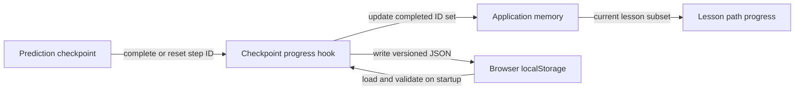

# Durable Checkpoint Progress

## Purpose

Completed prediction checkpoints survive lesson changes, page reloads, and later
visits from the same browser. A student can reset an individual checkpoint
without losing progress from other lessons.

This feature uses browser-local storage. It does not imply an account, cloud
synchronization, or progress shared between devices.

## Acceptance criteria

- Completing a checkpoint saves its stable step ID.
- Saved completion is restored after the application remounts or reloads.
- Progress from one lesson does not change the displayed total for another.
- Resetting a checkpoint removes its ID and persists that removal.
- Only IDs that still exist in current lesson content are restored.
- Malformed records and unsupported schema versions are ignored safely.
- Blocked or failed browser storage does not prevent checkpoint interaction.
- The interface states whether progress is durable or session-only.
- Selected wrong answers, retry feedback, and attempt counts are not persisted.

## State and storage flow



`Prediction checkpoint` owns the temporary answer selection and feedback. The
`Checkpoint progress hook` owns completion operations and the storage boundary.
`Application memory` keeps the interface responsive even if persistence fails.
`Browser localStorage` provides durability on one browser and origin. `Lesson
path progress` derives only the active lesson's total from the shared set.

The complete/reset arrows carry stable step IDs upward. The storage arrows write
and restore a versioned record. The final arrow filters course-wide progress to
the lesson being displayed. The story is one-way data flow: an interaction emits
an event, the parent changes domain state, and the UI renders from that state.

The important limitation is that `localStorage` is local to one browser profile.
This design cannot synchronize devices or authenticate a student.

## Stored schema

Storage key:

```text
javascript-adventure-lab:checkpoint-progress
```

Version 1 value:

```json
{
  "version": 1,
  "completedStepIds": ["predict-a-click"]
}
```

The version makes incompatible future changes detectable. Unknown step IDs are
filtered against current lesson content, so deleted or renamed checkpoints do
not inflate progress.

## Failure behavior

Browser storage can fail in private modes, restricted environments, or when a
quota is exhausted. Reads and writes therefore sit behind a small adapter that
returns a status instead of throwing into React.

- Invalid JSON or an unsupported schema starts with empty progress. Because
  storage itself still works, the next save replaces the invalid record.
- A storage access exception falls back to in-memory state.
- Completion and reset remain usable during the current session.
- The lesson path explains that session progress could not be saved.

This is graceful degradation: the primary learning interaction remains useful,
but the product does not pretend persistence succeeded.

## Architecture trade-offs

No state-management or persistence library is used. The current state is one set
with two operations, so a React hook and a narrow adapter are sufficient. A
library would add concepts and dependencies without solving a current problem.

Synchronous `localStorage` is acceptable for this small record. It would be a
poor choice for student projects, large content, high-frequency writes, or
multi-user synchronization; those needs would justify IndexedDB or a backend.

## Verification

Tests cover:

- schema validation and filtering stale IDs;
- malformed, future-version, and inaccessible storage;
- versioned serialization;
- completion restoration after remounting;
- durable reset;
- independent per-lesson totals;
- completed-checkpoint rendering from parent state;
- visible session-only fallback when writes fail.

## Known limitations

- Clearing browser site data removes progress.
- Progress is not synchronized across tabs until a tab reloads.
- Schema version 1 has no migration path; future versions are currently ignored.
- Completion timestamps and attempt history are not recorded.
- There is no course-wide reset control yet.
