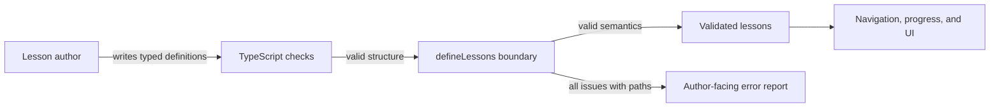

# Lesson Content Validation

## Purpose

Lesson authors need errors that identify what is wrong, where it is wrong, and
what a valid replacement looks like. The lesson boundary validates semantic
content rules before definitions reach navigation, persistence, or rendering.

The implementation complements TypeScript. It does not add a schema dependency
or pretend that automated rules can judge teaching quality.

## Acceptance criteria

- Valid bundled lessons pass without changing their inferred literal types.
- All detected issues are returned together rather than stopping at the first.
- Every issue includes a property path such as `lessons[1].steps[0].id`.
- Duplicate errors identify both the duplicate and original locations.
- Course numbering, identifiers, required text, objectives, step sequence, and
  prediction relationships are validated.
- Prediction step IDs are unique across the course so persisted progress cannot
  leak between lessons.
- Invalid definitions throw one readable report at the content boundary.
- Validation requires no production dependency.

## Validation flow



`Lesson author` represents a contributor editing the bundled content.
`TypeScript checks` proves the required property shapes and discriminated step
kinds. The `defineLessons boundary` checks relationships and authoring rules.
`Validated lessons` is the unchanged, precisely inferred data. The consumers use
that one trusted export. `Author-facing error report` aggregates every issue the
validator can identify.

The arrows tell a fail-fast story: structurally valid definitions reach the
semantic boundary, then either become trusted lesson data or produce an
actionable report. Invalid content does not continue silently into persistence
or rendering.

The limitation is that this flow starts from TypeScript source. Loading untyped
JSON from a server would require structural parsing before this semantic layer.

## Rules and reasons

| Area           | Rule                                                          | Engineering reason                                    |
| -------------- | ------------------------------------------------------------- | ----------------------------------------------------- |
| Course         | At least one lesson                                           | Navigation needs a valid default lesson.              |
| Number         | Positive, whole, and equal to course position                 | Progress and visible ordering must agree.             |
| Slug           | Unique lowercase kebab-case                                   | Hash URLs must remain stable and unambiguous.         |
| Author text    | Required strings cannot be blank                              | Empty panels are valid HTML but broken content.       |
| Objectives     | At least one; no exact duplicates                             | Each lesson needs explicit, non-repeated outcomes.    |
| Steps          | Exactly explain → predict → practice                          | The initial teaching method depends on this sequence. |
| Step ID        | Unique across the entire course                               | Durable progress is keyed by step ID.                 |
| Prediction     | Question and feedback cannot be blank                         | Students need a prompt and useful outcomes.           |
| Options        | At least two, with unique kebab-case IDs and non-empty labels | A prediction needs a real choice and stable answers.  |
| Correct answer | Must reference an existing option ID                          | Otherwise no student could complete the checkpoint.   |

## Error format

`defineLessons` throws one error after collecting all issues:

```text
Lesson content validation failed with 2 issues:
- lessons[1].slug: "meet-the-browser" is already used at lessons[0].slug.
- lessons[1].steps[1].correctOptionId: "missing" does not match an option ID.
```

Property paths are used instead of lesson titles because titles can themselves
be missing, duplicated, or under active editing. Duplicate messages include the
first location to remove guesswork.

## When validation runs

`lessons.ts` exports the result of `defineLessons(...)`. Importing lesson content
during development or tests therefore validates it immediately. CI imports the
same module through the automated test suite, so invalid bundled content blocks
the pull request quality gate.

Validation returns the original definitions rather than copying them. This
preserves literal slug types used by hash navigation and avoids creating a
second representation of lesson content.

## Testing strategy

Tests prove that:

- current bundled content passes;
- duplicate slugs and course-wide step IDs report both locations;
- blank text, missing objectives, and wrong sequence are reported;
- multiple prediction-option problems appear in one report;
- invalid course numbers and identifier formats receive corrective guidance;
- `defineLessons` throws the aggregated report.

The older lesson integrity tests remain as focused regression checks for the
current learning sequence. The validator tests exercise the reusable authoring
contract with deliberately invalid fixtures.

## Known limitations

- The validator accepts typed `LessonDefinition` values; it is not an untrusted
  JSON parser.
- It checks presence and relationships, not factual accuracy or teaching quality.
- Text length, reading level, and terminology consistency are not automated.
- Exact duplicate objectives are detected, but semantically equivalent wording
  is not.
- Error messages are currently written only in English.
